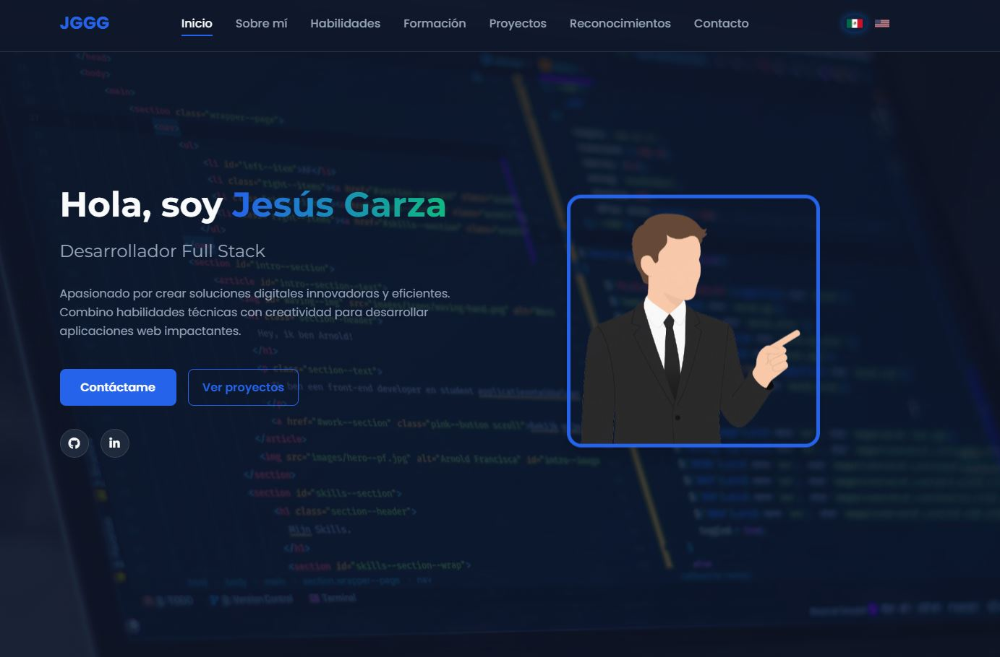

# Portafolio de JesusGGGGit

     

Portafolio web personal de Jesus Garza, backend developer con enfoque en Python, PostgreSQL y Odoo. Presenta experiencia, proyectos y habilidades con una interfaz moderna, tema claro/oscuro e internacionalizacion ES/EN.

## Sobre mi

Soy desarrollador backend con experiencia en desarrollo de modulos para Odoo, integraciones XML-RPC y automatizacion de procesos. He trabajado con Python, PostgreSQL y Linux, y me enfoco en codigo limpio, mantenible y orientado a resolver problemas reales. Nivel de ingles avanzado.

## Lo que incluye

- Secciones de experiencia, proyectos, habilidades, formacion y contacto.
- Portal interactivo para explorar proyectos destacados.
- Animaciones suaves y efectos visuales discretos.
- Tema claro/oscuro y soporte multilenguaje.

## Tecnologias

- HTML5, CSS3, JavaScript.
- Arquitectura CSS modular.
- i18n con archivos JSON.

## Habilidades

- Backend: Python, Odoo, PostgreSQL, APIs REST, ORM.
- Datos: diseno de esquemas, optimizacion de consultas, reportes.
- DevOps: Linux, despliegues.
- Integraciones: XML-RPC, automatizacion de procesos.
- Buenas practicas: codigo limpio, pruebas basicas, documentacion.

## Vista previa

## Estructura

- css/ estilos por modulos.
- js/ logica dividida por funcionalidades.
- i18n/ traducciones ES y EN.
- assets/ recursos (imagenes, certificados, demos).

## Ejecutar local

Abre [index.html](index.html) en el navegador. No requiere dependencias.

## Contacto

- Email: jesusgarzacia@hotmail.com
- GitHub: https://github.com/JesusGGGGit
- LinkedIn: https://www.linkedin.com/in/jesus-garza-garcia

---

# Portfolio of JesusGGGGit

     

Personal web portfolio of Jesus Garza, a backend developer focused on Python, PostgreSQL, and Odoo. It showcases experience, projects, and skills with a modern interface, light/dark theme, and ES/EN internationalization.

## About me

I am a backend developer with experience building Odoo modules, XML-RPC integrations, and process automation. I have worked with Python, PostgreSQL, and Linux, and I focus on clean, maintainable code that solves real problems.

## What is included

- Sections for experience, projects, skills, education, and contact.
- Interactive portal to explore featured projects.
- Smooth animations and subtle visual effects.
- Light/dark theme and multilingual support.

## Technologies

- HTML5, CSS3, JavaScript.
- Modular CSS architecture.
- JSON-based i18n.

## Skills

- Backend: Python, Odoo, PostgreSQL, REST APIs, ORM.
- Data: schema design, query optimization, reporting.
- DevOps: Linux, basic deployments.
- Integrations: XML-RPC, process automation.
- Good practices: clean code, basic testing, documentation.

## Preview

## Structure

- css/ styles by modules.
- js/ logic split by features.
- i18n/ ES and EN translations.
- assets/ resources (images, certificates, demos).

## Run locally

Open [index.html](index.html) in your browser. No dependencies required.

## Contact

- Email: jesusgarzacia@hotmail.com
- GitHub: https://github.com/JesusGGGGit
- LinkedIn: https://www.linkedin.com/in/jesus-garza-garcia
